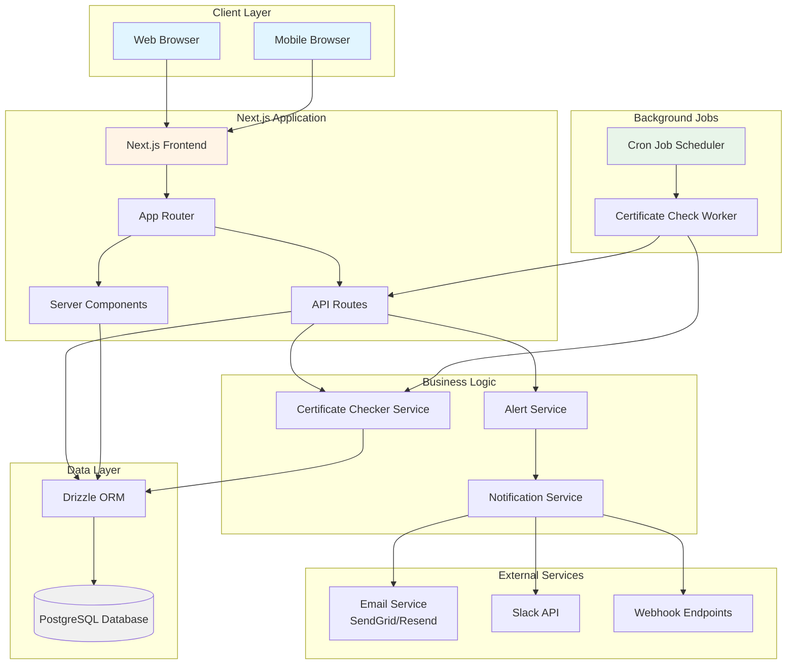

# System Architecture Overview

This diagram shows the high-level architecture of the SSL Certificate Tracking System, including all major components and their relationships.

## Component Description

### Client Layer
- **Web Browser**: Desktop web interface
- **Mobile Browser**: Mobile-responsive interface

### Next.js Application
- **Next.js Frontend**: React-based UI with TailwindCSS and shadcn/ui
- **App Router**: Next.js 14+ App Router for routing
- **API Routes**: RESTful API endpoints
- **Server Components**: Server-side rendered components

### Business Logic
- **Certificate Checker Service**: Core service for SSL certificate validation
- **Alert Service**: Manages alert generation and rules
- **Notification Service**: Handles multi-channel notifications

### Data Layer
- **PostgreSQL Database**: Primary data store
- **Drizzle ORM**: Type-safe database access layer

### External Services
- **Email Service**: Transactional email delivery
- **Slack API**: Team collaboration notifications
- **Webhook Endpoints**: Custom integrations

### Background Jobs
- **Cron Job Scheduler**: Scheduled task execution
- **Certificate Check Worker**: Automated certificate monitoring
