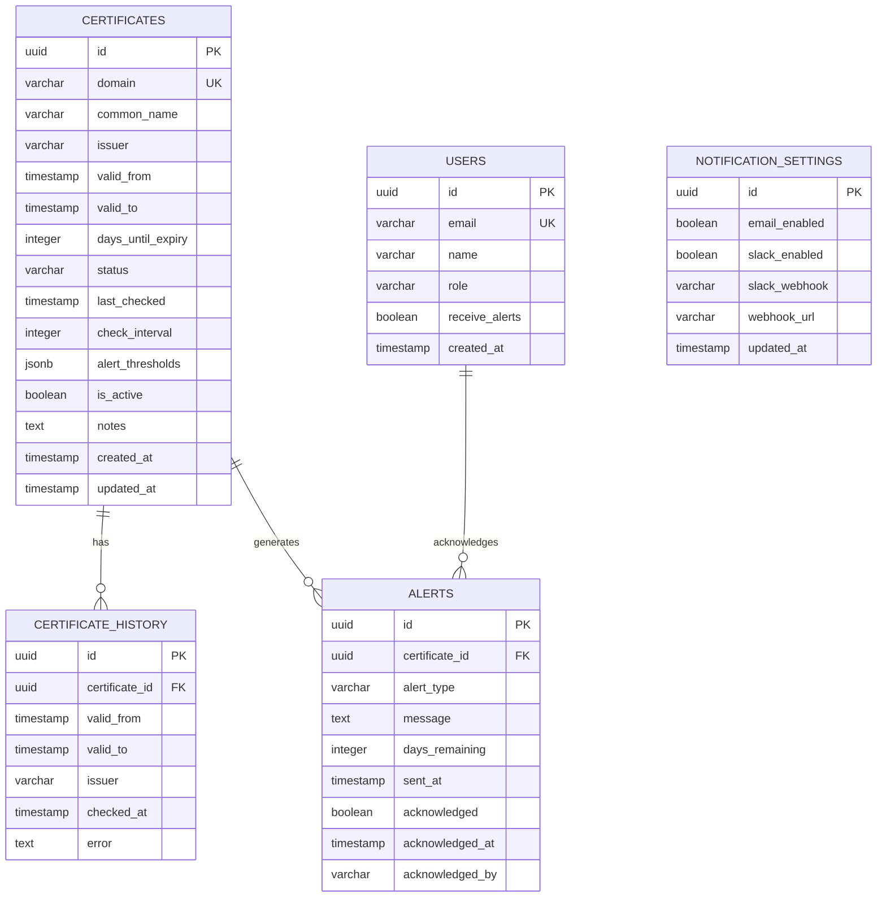

# Database Schema (Entity Relationship Diagram)

This ERD shows the complete database schema for the SSL Certificate Tracking System using Drizzle ORM with PostgreSQL.

## Table Descriptions

### CERTIFICATES
Primary table storing SSL certificate information for monitored domains.
- **Unique Constraint**: domain (each domain can only be tracked once)
- **Status Values**: active, expiring, expired, error
- **alert_thresholds**: JSON array of days [30, 14, 7, 1] when to send alerts

### CERTIFICATE_HISTORY
Historical record of certificate checks and renewals for audit trail.
- Tracks certificate changes over time
- Records errors for troubleshooting

### ALERTS
All alerts generated by the system, including acknowledgment tracking.
- **Alert Types**: expiry_warning, expired, error
- Links to the user who acknowledged the alert

### USERS
User accounts with role-based access control.
- **Roles**: admin (full access), editor (manage certificates), viewer (read-only)
- Controls who receives alert notifications

### NOTIFICATION_SETTINGS
Global notification configuration for the system.
- Single-row table (singleton pattern)
- Stores webhook URLs and channel enablement flags
