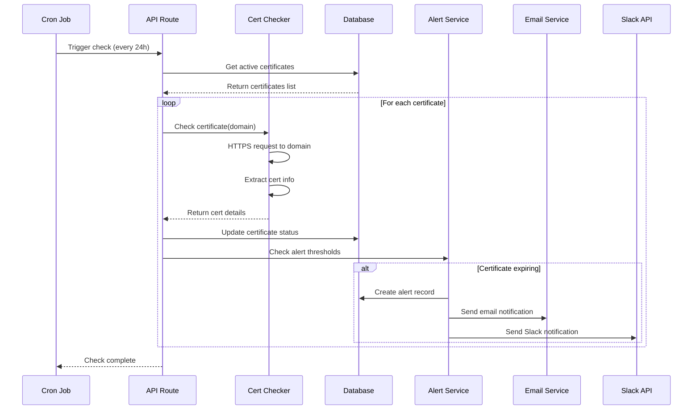

# Certificate Checking Flow (Sequence Diagram)

This sequence diagram shows the complete flow of the automated certificate checking process, including alert generation and notifications.

## Flow Description

### 1. Cron Trigger
The scheduled job (runs every 24 hours or configurable interval) triggers the certificate check process.

### 2. Fetch Certificates
The API retrieves all active certificates from the database that need to be checked.

### 3. Certificate Checking Loop
For each certificate:
- **HTTPS Request**: Connect to the domain on port 443
- **SSL Extraction**: Extract certificate details (validity dates, issuer, subject)
- **Calculation**: Compute days until expiry
- **Status Update**: Update the certificate record in the database

### 4. Alert Threshold Evaluation
The alert service checks if the certificate has crossed any alert thresholds:
- Default thresholds: 30, 14, 7, 1 days before expiry
- Configurable per certificate

### 5. Notification Dispatch
If an alert condition is met:
- Create an alert record in the database
- Send email notifications to subscribed users
- Send Slack notifications to configured channels
- Trigger webhooks for external integrations

## Error Handling

- **Connection Failures**: Certificate marked as "error" status
- **Invalid Certificates**: Logged in certificate_history table
- **Notification Failures**: Logged but don't block the checking process
- **Retry Logic**: Failed checks can be manually retried

## Performance Considerations

- **Batch Processing**: Certificates checked in parallel (with rate limiting)
- **Timeout Settings**: 10-second timeout per certificate check
- **Throttling**: Respect rate limits for external notification services
