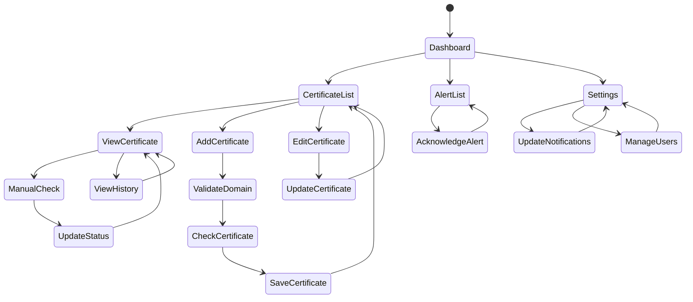

# User Interaction Flow (State Diagram)

This state diagram shows the various user navigation paths and interactions within the admin interface.

## User Journey Descriptions

### Dashboard Navigation
The entry point where users see an overview of their certificate status:
- Quick stats (total, active, expiring, expired)
- Recent alerts
- Certificates expiring soon

From the dashboard, users can navigate to:
- **Certificate List**: View all monitored certificates
- **Alert List**: Review and manage alerts
- **Settings**: Configure system settings

### Certificate Management Flow

#### Adding a Certificate
1. **Add Certificate**: User clicks "Add Certificate" button
2. **Validate Domain**: System validates domain format
3. **Check Certificate**: System performs initial SSL check
4. **Save Certificate**: Certificate added to monitoring list

#### Viewing Certificate Details
- Display full certificate information
- Show expiration timeline
- View certificate history
- Access to manual check button

#### Manual Certificate Check
1. **Manual Check**: User triggers immediate certificate check
2. **Update Status**: System fetches latest certificate info
3. **View Certificate**: Updated information displayed

#### Editing Certificate
- Modify alert thresholds
- Update notes
- Change check interval
- Toggle active status

### Alert Management
- **View Alerts**: Browse all system alerts
- **Acknowledge Alert**: Mark alert as reviewed
- **Filter Alerts**: By status, certificate, or date

### Settings Management

#### Notification Settings
- Enable/disable email notifications
- Configure Slack webhook
- Set up custom webhooks
- Define global alert thresholds

#### User Management
- Create new users
- Assign roles (Admin, Editor, Viewer)
- Configure individual notification preferences
- Deactivate users

## Role-Based Access

### Admin
- Full access to all features
- User management
- System settings configuration

### Editor
- Add/edit/delete certificates
- Acknowledge alerts
- View all data
- Cannot manage users or settings

### Viewer
- Read-only access
- View certificates and alerts
- Cannot modify any data
