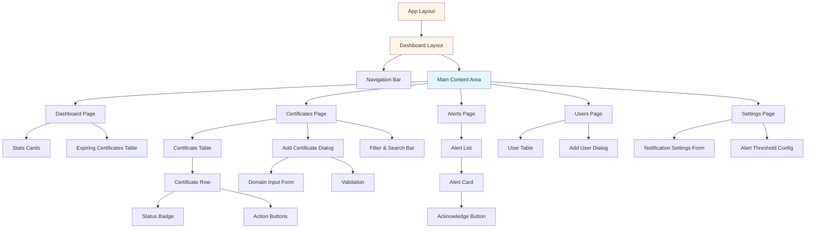

# Component Hierarchy

This diagram shows the React component structure for the Next.js frontend, built with shadcn/ui and TailwindCSS.



## Component Details

### Layout Components

#### App Layout (`app/layout.tsx`)
- Root layout wrapper
- Global styles and providers
- Theme provider (light/dark mode)

#### Dashboard Layout (`app/(dashboard)/layout.tsx`)
- Authenticated layout
- Navigation sidebar/header
- Breadcrumbs
- User profile dropdown

#### Navigation Bar
- Logo and branding
- Main navigation links
- User menu
- Notifications badge

### Page Components

#### Dashboard Page
**Stats Cards**
- Total certificates count
- Active certificates
- Expiring soon (< 30 days)
- Expired certificates
- Uses shadcn/ui Card component

**Expiring Certificates Table**
- Shows certificates expiring in next 30 days
- Sorted by days remaining
- Quick action buttons

#### Certificates Page
**Certificate Table**
- Sortable columns (domain, expiry date, status)
- Pagination
- Bulk actions
- Uses shadcn/ui Table component

**Certificate Row**
- Domain name with icon
- Status badge (color-coded)
- Days until expiry
- Action buttons (view, edit, delete, check)

**Add Certificate Dialog**
- Modal form using shadcn/ui Dialog
- Domain input with validation
- Alert threshold configuration
- Check interval setting

**Filter & Search Bar**
- Search by domain
- Filter by status
- Sort options
- Export button

#### Alerts Page
**Alert List**
- Chronological alert feed
- Filter by acknowledged status
- Filter by certificate

**Alert Card**
- Alert icon and severity
- Certificate domain
- Alert message
- Days remaining
- Acknowledge button
- Timestamp

#### Users Page
**User Table**
- User list with email, name, role
- Last active timestamp
- Alert preferences indicator

**Add User Dialog**
- Email input with validation
- Name field
- Role selection (dropdown)
- Notification preferences toggle

#### Settings Page
**Notification Settings Form**
- Email toggle
- Slack configuration
  - Webhook URL input
  - Test notification button
- Custom webhook configuration
- Global alert thresholds

**Alert Threshold Config**
- Multi-input for threshold days
- Add/remove threshold values
- Preview of alert schedule

## Reusable Components

### shadcn/ui Components Used
- `Button` - All interactive buttons
- `Card` - Container for stats and content
- `Table` - Data tables
- `Dialog` - Modals and forms
- `Input` - Text inputs
- `Select` - Dropdowns
- `Badge` - Status indicators
- `Alert` - Information messages
- `Tabs` - Tabbed interfaces
- `Form` - Form handling with react-hook-form
- `Tooltip` - Helpful hints
- `Dropdown Menu` - Action menus

### Custom Components
- `StatusBadge` - Certificate status indicator
- `ExpiryTimeline` - Visual expiry countdown
- `CertificateIcon` - SSL lock icon with status
- `LoadingSpinner` - Loading states
- `EmptyState` - No data placeholders

## File Structure
```
app/
├── layout.tsx
├── (dashboard)/
│   ├── layout.tsx
│   ├── page.tsx
│   ├── certificates/
│   │   ├── page.tsx
│   │   ├── [id]/page.tsx
│   │   └── new/page.tsx
│   ├── alerts/
│   │   └── page.tsx
│   ├── users/
│   │   └── page.tsx
│   └── settings/
│       └── page.tsx
└── components/
    ├── ui/                     # shadcn/ui components
    ├── layout/
    │   ├── nav-bar.tsx
    │   └── sidebar.tsx
    ├── certificates/
    │   ├── certificate-table.tsx
    │   ├── certificate-row.tsx
    │   ├── add-certificate-dialog.tsx
    │   ├── status-badge.tsx
    │   └── expiry-timeline.tsx
    ├── alerts/
    │   ├── alert-list.tsx
    │   └── alert-card.tsx
    ├── users/
    │   ├── user-table.tsx
    │   └── add-user-dialog.tsx
    └── dashboard/
        └── stats-cards.tsx
```
