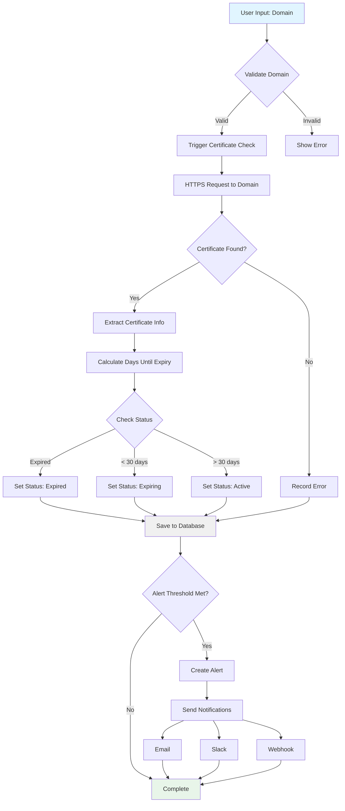

# Data Flow Diagram

This diagram illustrates how data flows through the system from user input to storage and notification.



## Data Flow Stages

### 1. User Input & Validation
**Input**: User enters a domain name (e.g., "example.com")

**Validation Checks**:
- Valid domain format (regex validation)
- No protocol prefix (http/https should be stripped)
- Domain doesn't already exist in system
- Valid DNS resolution

**Output**: 
- Valid → Proceed to certificate check
- Invalid → Display error message to user

### 2. Certificate Check
**HTTPS Request**:
- Connect to domain:443
- Establish TLS handshake
- Retrieve peer certificate

**Certificate Extraction**:
```javascript
{
  subject: { CN: "example.com" },
  issuer: { O: "Let's Encrypt", CN: "..." },
  valid_from: "2024-01-01T00:00:00Z",
  valid_to: "2024-04-01T00:00:00Z",
  fingerprint: "...",
  serialNumber: "..."
}
```

**Error Handling**:
- Connection timeout (10s)
- Invalid certificate
- Self-signed certificate (warning)
- Certificate chain issues

### 3. Data Processing

#### Days Until Expiry Calculation
```typescript
const now = new Date();
const expiryDate = new Date(certificate.valid_to);
const daysUntilExpiry = Math.floor(
  (expiryDate.getTime() - now.getTime()) / (1000 * 60 * 60 * 24)
);
```

#### Status Determination
```typescript
let status: CertificateStatus;
if (daysUntilExpiry < 0) {
  status = 'expired';
} else if (daysUntilExpiry <= 30) {
  status = 'expiring';
} else {
  status = 'active';
}
```

### 4. Database Storage

**Certificate Record**:
```typescript
{
  id: uuid(),
  domain: "example.com",
  commonName: "example.com",
  issuer: "Let's Encrypt",
  validFrom: Date,
  validTo: Date,
  daysUntilExpiry: 45,
  status: "active",
  lastChecked: Date,
  checkInterval: 86400, // seconds
  alertThresholds: [30, 14, 7, 1],
  isActive: true,
  createdAt: Date,
  updatedAt: Date
}
```

**History Record** (for audit trail):
```typescript
{
  id: uuid(),
  certificateId: uuid(),
  validFrom: Date,
  validTo: Date,
  issuer: "Let's Encrypt",
  checkedAt: Date,
  error: null
}
```

### 5. Alert Evaluation

**Threshold Checking**:
```typescript
const thresholds = [30, 14, 7, 1]; // days
const shouldAlert = thresholds.includes(daysUntilExpiry);
```

**Alert Conditions**:
- Certificate crosses a threshold (30, 14, 7, 1 day)
- Certificate has expired (0 days)
- Certificate check failed (error status)
- Alert not already sent for this threshold

### 6. Notification Dispatch

**Email Notification**:
```typescript
{
  to: ["admin@company.com"],
  subject: "SSL Certificate Expiring: example.com",
  body: "Certificate for example.com will expire in 7 days",
  priority: "high"
}
```

**Slack Notification**:
```json
{
  "text": "⚠️ SSL Certificate Alert",
  "blocks": [
    {
      "type": "section",
      "text": {
        "type": "mrkdwn",
        "text": "*example.com* expires in 7 days"
      }
    }
  ]
}
```

**Webhook Notification**:
```json
{
  "event": "certificate.expiring",
  "domain": "example.com",
  "daysRemaining": 7,
  "validTo": "2024-04-01T00:00:00Z",
  "timestamp": "2024-03-25T10:00:00Z"
}
```

## Data Transformations

### Input → Database
```typescript
// User input
"example.com"

// After processing
{
  domain: "example.com",
  validTo: Date("2024-04-01"),
  daysUntilExpiry: 45,
  status: "active"
}
```

### Database → UI Display
```typescript
// Database record
{ daysUntilExpiry: 7, status: "expiring" }

// UI display
"⚠️ Expires in 7 days"
```

### Database → Notification
```typescript
// Database record
{ domain: "example.com", daysUntilExpiry: 1 }

// Email subject
"URGENT: example.com SSL certificate expires tomorrow"
```
