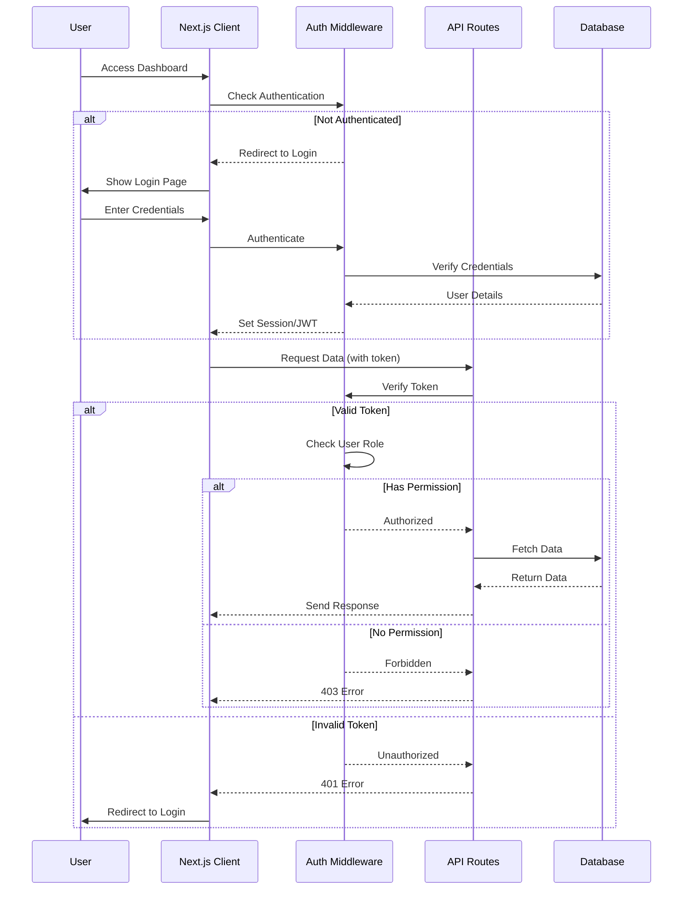

# Security & Authentication Flow

This sequence diagram shows the authentication and authorization flow for the SSL Certificate Tracking System.



## Authentication Strategy

### Option 1: NextAuth.js (Recommended)
```typescript
// app/api/auth/[...nextauth]/route.ts
import NextAuth from "next-auth";
import CredentialsProvider from "next-auth/providers/credentials";

export const authOptions = {
  providers: [
    CredentialsProvider({
      credentials: {
        email: { label: "Email", type: "email" },
        password: { label: "Password", type: "password" }
      },
      async authorize(credentials) {
        // Verify credentials against database
        const user = await verifyUser(credentials);
        if (user) {
          return { id: user.id, email: user.email, role: user.role };
        }
        return null;
      }
    })
  ],
  callbacks: {
    async jwt({ token, user }) {
      if (user) {
        token.role = user.role;
        token.id = user.id;
      }
      return token;
    },
    async session({ session, token }) {
      session.user.role = token.role;
      session.user.id = token.id;
      return session;
    }
  },
  pages: {
    signIn: '/login',
  }
};

const handler = NextAuth(authOptions);
export { handler as GET, handler as POST };
```

### Option 2: Custom JWT Authentication
```typescript
// lib/auth.ts
import jwt from 'jsonwebtoken';
import bcrypt from 'bcryptjs';

export async function login(email: string, password: string) {
  const user = await db.query.users.findFirst({
    where: eq(users.email, email)
  });
  
  if (!user || !await bcrypt.compare(password, user.passwordHash)) {
    throw new Error('Invalid credentials');
  }
  
  const token = jwt.sign(
    { userId: user.id, email: user.email, role: user.role },
    process.env.JWT_SECRET!,
    { expiresIn: '7d' }
  );
  
  return { token, user };
}

export function verifyToken(token: string) {
  try {
    return jwt.verify(token, process.env.JWT_SECRET!);
  } catch {
    return null;
  }
}
```

## Authorization Middleware

```typescript
// lib/middleware/auth.ts
import { NextRequest, NextResponse } from 'next/server';
import { verifyToken } from '@/lib/auth';

export async function authMiddleware(request: NextRequest) {
  const token = request.cookies.get('auth-token')?.value ||
                request.headers.get('authorization')?.replace('Bearer ', '');
  
  if (!token) {
    return NextResponse.json(
      { error: 'Unauthorized' },
      { status: 401 }
    );
  }
  
  const payload = verifyToken(token);
  if (!payload) {
    return NextResponse.json(
      { error: 'Invalid token' },
      { status: 401 }
    );
  }
  
  // Attach user to request
  request.user = payload;
  return null; // Continue
}
```

## Role-Based Access Control (RBAC)

### Permission Matrix

| Resource | Admin | Editor | Viewer |
|----------|-------|--------|--------|
| View Certificates | ✅ | ✅ | ✅ |
| Add Certificate | ✅ | ✅ | ❌ |
| Edit Certificate | ✅ | ✅ | ❌ |
| Delete Certificate | ✅ | ✅ | ❌ |
| View Alerts | ✅ | ✅ | ✅ |
| Acknowledge Alerts | ✅ | ✅ | ❌ |
| Delete Alerts | ✅ | ❌ | ❌ |
| Manage Users | ✅ | ❌ | ❌ |
| Edit Settings | ✅ | ❌ | ❌ |
| Trigger Manual Check | ✅ | ✅ | ❌ |

### Implementation

```typescript
// lib/middleware/rbac.ts
type Role = 'admin' | 'editor' | 'viewer';
type Action = 'create' | 'read' | 'update' | 'delete';
type Resource = 'certificate' | 'alert' | 'user' | 'settings';

const permissions: Record<Role, Record<Resource, Action[]>> = {
  admin: {
    certificate: ['create', 'read', 'update', 'delete'],
    alert: ['create', 'read', 'update', 'delete'],
    user: ['create', 'read', 'update', 'delete'],
    settings: ['create', 'read', 'update', 'delete']
  },
  editor: {
    certificate: ['create', 'read', 'update', 'delete'],
    alert: ['read', 'update'],
    user: ['read'],
    settings: ['read']
  },
  viewer: {
    certificate: ['read'],
    alert: ['read'],
    user: ['read'],
    settings: ['read']
  }
};

export function checkPermission(
  role: Role,
  resource: Resource,
  action: Action
): boolean {
  return permissions[role]?.[resource]?.includes(action) ?? false;
}

// Usage in API route
export async function DELETE(
  request: NextRequest,
  { params }: { params: { id: string } }
) {
  const user = request.user;
  
  if (!checkPermission(user.role, 'certificate', 'delete')) {
    return NextResponse.json(
      { error: 'Insufficient permissions' },
      { status: 403 }
    );
  }
  
  // Proceed with deletion
}
```

## API Route Protection

```typescript
// app/api/certificates/route.ts
import { authMiddleware } from '@/lib/middleware/auth';
import { checkPermission } from '@/lib/middleware/rbac';

export async function GET(request: NextRequest) {
  // Check authentication
  const authError = await authMiddleware(request);
  if (authError) return authError;
  
  // Check authorization
  if (!checkPermission(request.user.role, 'certificate', 'read')) {
    return NextResponse.json(
      { error: 'Forbidden' },
      { status: 403 }
    );
  }
  
  // Fetch certificates
  const certificates = await db.select().from(certificates);
  return NextResponse.json({ certificates });
}

export async function POST(request: NextRequest) {
  const authError = await authMiddleware(request);
  if (authError) return authError;
  
  if (!checkPermission(request.user.role, 'certificate', 'create')) {
    return NextResponse.json(
      { error: 'Forbidden' },
      { status: 403 }
    );
  }
  
  // Create certificate
}
```

## Cron Job Security

```typescript
// app/api/cron/check-certificates/route.ts
export async function GET(request: Request) {
  // Verify cron secret
  const authHeader = request.headers.get('authorization');
  const expectedAuth = `Bearer ${process.env.CRON_SECRET}`;
  
  if (authHeader !== expectedAuth) {
    return new NextResponse('Unauthorized', { status: 401 });
  }
  
  // Proceed with certificate checks
  await checkAllCertificates();
  return NextResponse.json({ success: true });
}
```

## Security Best Practices

### Password Storage
```typescript
import bcrypt from 'bcryptjs';

// Hash password before storage
const passwordHash = await bcrypt.hash(password, 10);

// Verify password
const isValid = await bcrypt.compare(inputPassword, storedHash);
```

### Environment Variables
```env
# .env.local
DATABASE_URL=postgresql://...
JWT_SECRET=your-super-secret-key-min-32-chars
CRON_SECRET=another-secret-for-cron-jobs
NEXTAUTH_SECRET=nextauth-secret-key
NEXTAUTH_URL=https://your-domain.com
```

### CORS Configuration
```typescript
// middleware.ts
export function middleware(request: NextRequest) {
  const response = NextResponse.next();
  
  // Only allow specific origins
  const allowedOrigins = [
    'https://yourdomain.com',
    'https://admin.yourdomain.com'
  ];
  
  const origin = request.headers.get('origin');
  if (origin && allowedOrigins.includes(origin)) {
    response.headers.set('Access-Control-Allow-Origin', origin);
  }
  
  return response;
}
```

### Rate Limiting
```typescript
import { Ratelimit } from '@upstash/ratelimit';
import { Redis } from '@upstash/redis';

const ratelimit = new Ratelimit({
  redis: Redis.fromEnv(),
  limiter: Ratelimit.slidingWindow(10, '10 s'),
});

export async function POST(request: NextRequest) {
  const ip = request.ip ?? '127.0.0.1';
  const { success } = await ratelimit.limit(ip);
  
  if (!success) {
    return new NextResponse('Too Many Requests', { status: 429 });
  }
  
  // Process request
}
```

### Input Validation
```typescript
import { z } from 'zod';

const domainSchema = z.object({
  domain: z.string()
    .min(3)
    .max(255)
    .regex(/^[a-z0-9]+([\-\.]{1}[a-z0-9]+)*\.[a-z]{2,}$/),
  alertThresholds: z.array(z.number().positive()).optional(),
  notes: z.string().max(1000).optional()
});

export async function POST(request: NextRequest) {
  const body = await request.json();
  
  try {
    const validatedData = domainSchema.parse(body);
    // Use validatedData safely
  } catch (error) {
    return NextResponse.json(
      { error: 'Invalid input', details: error },
      { status: 400 }
    );
  }
}
```
