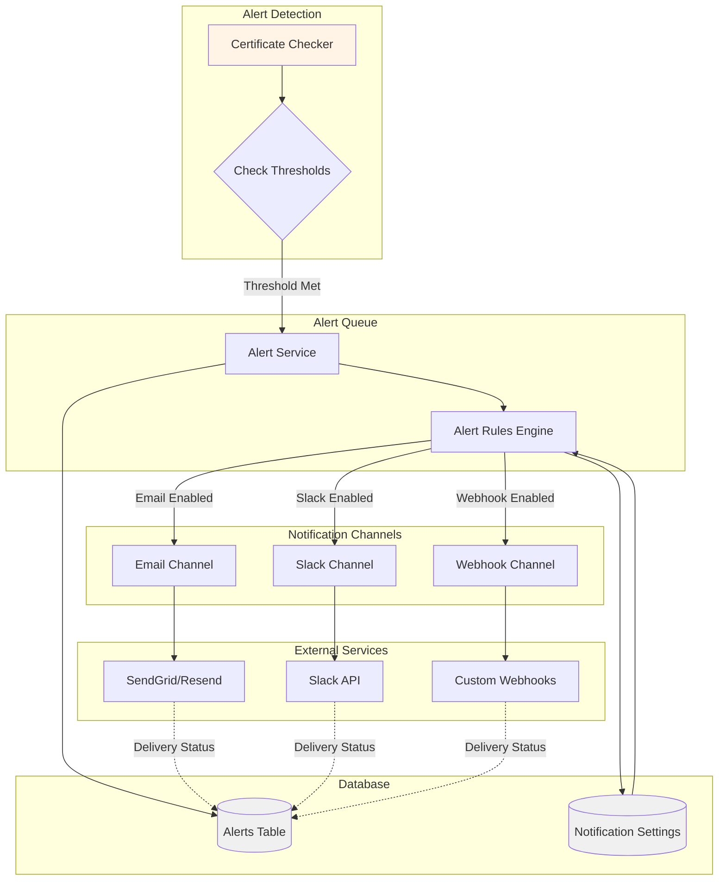

# Notification System Architecture

This diagram shows how the notification system routes alerts through different channels based on configuration.



## Alert Detection Logic

### Threshold Evaluation
```typescript
// lib/services/alert-service.ts
interface AlertThreshold {
  days: number;
  severity: 'low' | 'medium' | 'high' | 'critical';
}

const defaultThresholds: AlertThreshold[] = [
  { days: 30, severity: 'low' },
  { days: 14, severity: 'medium' },
  { days: 7, severity: 'high' },
  { days: 1, severity: 'critical' }
];

export async function evaluateAlertThresholds(certificate: Certificate) {
  const { daysUntilExpiry, alertThresholds } = certificate;
  
  // Use custom thresholds or defaults
  const thresholds = alertThresholds || defaultThresholds.map(t => t.days);
  
  // Check if we've crossed a threshold
  const shouldAlert = thresholds.some(threshold => {
    return daysUntilExpiry === threshold;
  });
  
  if (shouldAlert) {
    await createAlert(certificate, daysUntilExpiry);
  }
}
```

### Alert Types
```typescript
type AlertType = 
  | 'expiry_warning'    // Certificate expiring soon
  | 'expired'           // Certificate has expired
  | 'check_failed'      // Certificate check failed
  | 'renewed'           // Certificate was renewed
  | 'revoked';          // Certificate was revoked

interface Alert {
  id: string;
  certificateId: string;
  alertType: AlertType;
  severity: 'low' | 'medium' | 'high' | 'critical';
  message: string;
  daysRemaining?: number;
  sentAt: Date;
  acknowledged: boolean;
}
```

## Alert Rules Engine

```typescript
// lib/services/alert-rules.ts
interface AlertRule {
  condition: (cert: Certificate) => boolean;
  channels: ('email' | 'slack' | 'webhook')[];
  template: (cert: Certificate) => AlertMessage;
}

const alertRules: AlertRule[] = [
  {
    // Critical: Certificate expires in 1 day
    condition: (cert) => cert.daysUntilExpiry === 1,
    channels: ['email', 'slack', 'webhook'],
    template: (cert) => ({
      subject: `🚨 CRITICAL: ${cert.domain} expires TOMORROW`,
      body: `Certificate for ${cert.domain} will expire in 1 day.`,
      severity: 'critical'
    })
  },
  {
    // High: Certificate expires in 7 days
    condition: (cert) => cert.daysUntilExpiry === 7,
    channels: ['email', 'slack'],
    template: (cert) => ({
      subject: `⚠️ WARNING: ${cert.domain} expires in 7 days`,
      body: `Certificate for ${cert.domain} will expire in 7 days.`,
      severity: 'high'
    })
  },
  {
    // Medium: Certificate expires in 14 days
    condition: (cert) => cert.daysUntilExpiry === 14,
    channels: ['email'],
    template: (cert) => ({
      subject: `⚡ NOTICE: ${cert.domain} expires in 2 weeks`,
      body: `Certificate for ${cert.domain} will expire in 14 days.`,
      severity: 'medium'
    })
  },
  {
    // Low: Certificate expires in 30 days
    condition: (cert) => cert.daysUntilExpiry === 30,
    channels: ['email'],
    template: (cert) => ({
      subject: `ℹ️ INFO: ${cert.domain} expires in 30 days`,
      body: `Certificate for ${cert.domain} will expire in 30 days.`,
      severity: 'low'
    })
  }
];

export async function processAlert(certificate: Certificate) {
  const settings = await getNotificationSettings();
  
  for (const rule of alertRules) {
    if (rule.condition(certificate)) {
      const message = rule.template(certificate);
      
      // Send to enabled channels
      const promises = [];
      
      if (settings.emailEnabled && rule.channels.includes('email')) {
        promises.push(sendEmailNotification(certificate, message));
      }
      
      if (settings.slackEnabled && rule.channels.includes('slack')) {
        promises.push(sendSlackNotification(certificate, message));
      }
      
      if (settings.webhookUrl && rule.channels.includes('webhook')) {
        promises.push(sendWebhookNotification(certificate, message));
      }
      
      await Promise.all(promises);
    }
  }
}
```

## Notification Channels

### Email Channel

```typescript
// lib/services/email-service.ts
import { Resend } from 'resend';

const resend = new Resend(process.env.RESEND_API_KEY);

export async function sendEmailNotification(
  certificate: Certificate,
  message: AlertMessage
) {
  // Get users who should receive alerts
  const users = await db.select()
    .from(usersTable)
    .where(eq(usersTable.receiveAlerts, true));
  
  const recipients = users.map(u => u.email);
  
  try {
    const { data, error } = await resend.emails.send({
      from: 'SSL Monitor <alerts@yourdomain.com>',
      to: recipients,
      subject: message.subject,
      html: generateEmailTemplate(certificate, message)
    });
    
    if (error) {
      console.error('Email send failed:', error);
      throw error;
    }
    
    // Log successful delivery
    await logNotification({
      certificateId: certificate.id,
      channel: 'email',
      status: 'sent',
      recipients: recipients.length
    });
    
    return data;
  } catch (error) {
    await logNotification({
      certificateId: certificate.id,
      channel: 'email',
      status: 'failed',
      error: error.message
    });
    throw error;
  }
}

function generateEmailTemplate(
  certificate: Certificate,
  message: AlertMessage
): string {
  return `
    <!DOCTYPE html>
    <html>
      <head>
        <style>
          body { font-family: Arial, sans-serif; }
          .container { max-width: 600px; margin: 0 auto; padding: 20px; }
          .header { background: #dc2626; color: white; padding: 20px; border-radius: 8px 8px 0 0; }
          .content { background: #f9fafb; padding: 20px; border-radius: 0 0 8px 8px; }
          .button { background: #3b82f6; color: white; padding: 12px 24px; text-decoration: none; border-radius: 6px; }
        </style>
      </head>
      <body>
        <div class="container">
          <div class="header">
            <h1>🔒 SSL Certificate Alert</h1>
          </div>
          <div class="content">
            <h2>${message.subject}</h2>
            <p><strong>Domain:</strong> ${certificate.domain}</p>
            <p><strong>Expires:</strong> ${certificate.validTo}</p>
            <p><strong>Days Remaining:</strong> ${certificate.daysUntilExpiry}</p>
            <p>${message.body}</p>
            <p>
              <a href="https://yourdomain.com/certificates/${certificate.id}" class="button">
                View Certificate
              </a>
            </p>
          </div>
        </div>
      </body>
    </html>
  `;
}
```

### Slack Channel

```typescript
// lib/services/slack-service.ts
export async function sendSlackNotification(
  certificate: Certificate,
  message: AlertMessage
) {
  const settings = await getNotificationSettings();
  
  if (!settings.slackWebhook) {
    throw new Error('Slack webhook not configured');
  }
  
  const severity_emoji = {
    critical: '🚨',
    high: '⚠️',
    medium: '⚡',
    low: 'ℹ️'
  };
  
  const payload = {
    text: message.subject,
    blocks: [
      {
        type: 'header',
        text: {
          type: 'plain_text',
          text: `${severity_emoji[message.severity]} SSL Certificate Alert`
        }
      },
      {
        type: 'section',
        fields: [
          {
            type: 'mrkdwn',
            text: `*Domain:*\n${certificate.domain}`
          },
          {
            type: 'mrkdwn',
            text: `*Days Remaining:*\n${certificate.daysUntilExpiry}`
          },
          {
            type: 'mrkdwn',
            text: `*Expires:*\n${new Date(certificate.validTo).toLocaleDateString()}`
          },
          {
            type: 'mrkdwn',
            text: `*Status:*\n${certificate.status.toUpperCase()}`
          }
        ]
      },
      {
        type: 'section',
        text: {
          type: 'mrkdwn',
          text: message.body
        }
      },
      {
        type: 'actions',
        elements: [
          {
            type: 'button',
            text: {
              type: 'plain_text',
              text: 'View Certificate'
            },
            url: `https://yourdomain.com/certificates/${certificate.id}`,
            style: 'primary'
          },
          {
            type: 'button',
            text: {
              type: 'plain_text',
              text: 'Acknowledge'
            },
            url: `https://yourdomain.com/alerts/${certificate.id}/acknowledge`
          }
        ]
      }
    ]
  };
  
  try {
    const response = await fetch(settings.slackWebhook, {
      method: 'POST',
      headers: { 'Content-Type': 'application/json' },
      body: JSON.stringify(payload)
    });
    
    if (!response.ok) {
      throw new Error(`Slack API error: ${response.statusText}`);
    }
    
    await logNotification({
      certificateId: certificate.id,
      channel: 'slack',
      status: 'sent'
    });
  } catch (error) {
    await logNotification({
      certificateId: certificate.id,
      channel: 'slack',
      status: 'failed',
      error: error.message
    });
    throw error;
  }
}
```

### Webhook Channel

```typescript
// lib/services/webhook-service.ts
export async function sendWebhookNotification(
  certificate: Certificate,
  message: AlertMessage
) {
  const settings = await getNotificationSettings();
  
  if (!settings.webhookUrl) {
    throw new Error('Webhook URL not configured');
  }
  
  const payload = {
    event: 'certificate.alert',
    timestamp: new Date().toISOString(),
    alert: {
      type: message.alertType,
      severity: message.severity,
      subject: message.subject,
      message: message.body
    },
    certificate: {
      id: certificate.id,
      domain: certificate.domain,
      commonName: certificate.commonName,
      issuer: certificate.issuer,
      validFrom: certificate.validFrom,
      validTo: certificate.validTo,
      daysUntilExpiry: certificate.daysUntilExpiry,
      status: certificate.status
    }
  };
  
  try {
    const response = await fetch(settings.webhookUrl, {
      method: 'POST',
      headers: {
        'Content-Type': 'application/json',
        'User-Agent': 'SSL-Certificate-Tracker/1.0',
        'X-Webhook-Secret': process.env.WEBHOOK_SECRET || ''
      },
      body: JSON.stringify(payload)
    });
    
    if (!response.ok) {
      throw new Error(`Webhook error: ${response.status} ${response.statusText}`);
    }
    
    await logNotification({
      certificateId: certificate.id,
      channel: 'webhook',
      status: 'sent',
      webhookUrl: settings.webhookUrl
    });
  } catch (error) {
    await logNotification({
      certificateId: certificate.id,
      channel: 'webhook',
      status: 'failed',
      error: error.message
    });
    throw error;
  }
}
```

## Notification Settings Management

```typescript
// lib/services/notification-settings.ts
interface NotificationSettings {
  id: string;
  emailEnabled: boolean;
  slackEnabled: boolean;
  slackWebhook?: string;
  webhookUrl?: string;
  updatedAt: Date;
}

export async function getNotificationSettings(): Promise<NotificationSettings> {
  const [settings] = await db
    .select()
    .from(notificationSettingsTable)
    .limit(1);
  
  return settings;
}

export async function updateNotificationSettings(
  updates: Partial<NotificationSettings>
): Promise<NotificationSettings> {
  const [updated] = await db
    .update(notificationSettingsTable)
    .set({
      ...updates,
      updatedAt: new Date()
    })
    .returning();
  
  return updated;
}

// Test notification function
export async function sendTestNotification(
  channel: 'email' | 'slack' | 'webhook'
) {
  const testCertificate = {
    id: 'test-id',
    domain: 'test.example.com',
    daysUntilExpiry: 7,
    validTo: new Date(Date.now() + 7 * 24 * 60 * 60 * 1000),
    status: 'expiring'
  };
  
  const testMessage = {
    subject: 'Test Notification',
    body: 'This is a test notification from SSL Certificate Tracker.',
    severity: 'low' as const,
    alertType: 'expiry_warning' as const
  };
  
  switch (channel) {
    case 'email':
      return sendEmailNotification(testCertificate, testMessage);
    case 'slack':
      return sendSlackNotification(testCertificate, testMessage);
    case 'webhook':
      return sendWebhookNotification(testCertificate, testMessage);
  }
}
```

## Notification Logging

```typescript
// lib/services/notification-logger.ts
interface NotificationLog {
  id: string;
  certificateId: string;
  channel: 'email' | 'slack' | 'webhook';
  status: 'sent' | 'failed' | 'pending';
  recipients?: number;
  error?: string;
  createdAt: Date;
}

export async function logNotification(log: Omit<NotificationLog, 'id' | 'createdAt'>) {
  await db.insert(notificationLogsTable).values({
    id: crypto.randomUUID(),
    ...log,
    createdAt: new Date()
  });
}
```

## Delivery Retry Logic

```typescript
// lib/services/notification-retry.ts
export async function sendNotificationWithRetry(
  sendFn: () => Promise<any>,
  maxRetries = 3,
  delayMs = 1000
) {
  let lastError;
  
  for (let attempt = 0; attempt < maxRetries; attempt++) {
    try {
      return await sendFn();
    } catch (error) {
      lastError = error;
      console.error(`Notification attempt ${attempt + 1} failed:`, error);
      
      if (attempt < maxRetries - 1) {
        // Exponential backoff
        await new Promise(resolve => 
          setTimeout(resolve, delayMs * Math.pow(2, attempt))
        );
      }
    }
  }
  
  throw new Error(`Failed after ${maxRetries} attempts: ${lastError.message}`);
}
```
