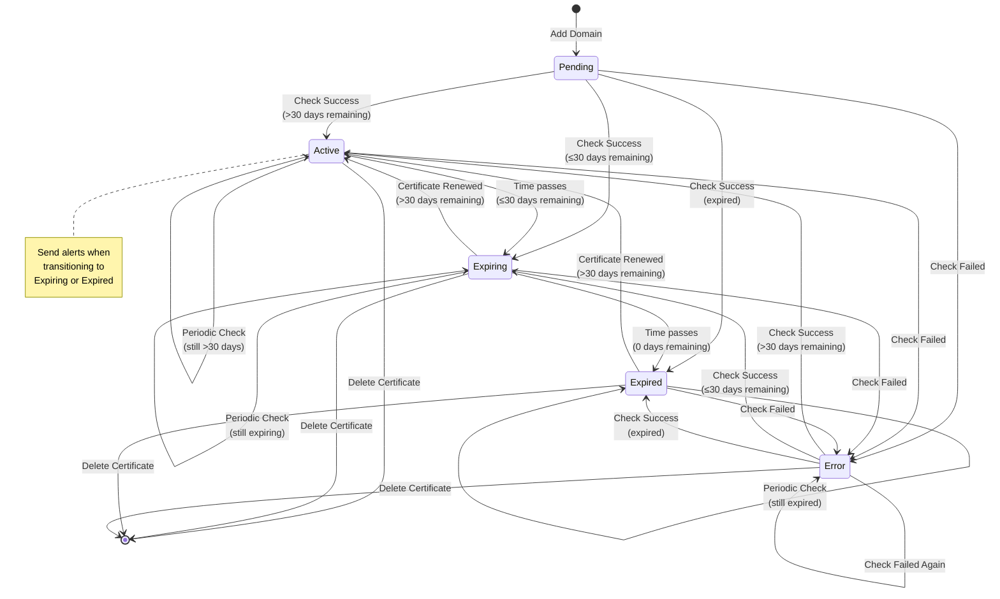

# Certificate Status State Machine

This state diagram shows all possible states a certificate can be in and the transitions between them.



## State Definitions

### Pending
**Description**: Initial state when a domain is first added to the system before any certificate check has been performed.

**Characteristics:**
- No certificate data available yet
- Waiting for initial check
- Cannot trigger alerts

**Next States:**
- Active (if check succeeds and cert is valid for >30 days)
- Expiring (if check succeeds and cert has ≤30 days)
- Expired (if check succeeds but cert already expired)
- Error (if check fails)

### Active
**Description**: Certificate is valid and has more than 30 days until expiration.

**Characteristics:**
- Certificate is healthy
- Regular monitoring continues
- No alerts sent (unless configured)

**Visual Indicator:**
- Badge color: Green
- Icon: ✓ or 🟢

**Next States:**
- Expiring (when days until expiry ≤ 30)
- Error (if check fails)
- Active (periodic checks while still valid)

### Expiring
**Description**: Certificate is valid but has 30 days or fewer until expiration.

**Characteristics:**
- Alerts are triggered based on thresholds
- Requires attention
- More frequent checks recommended

**Visual Indicator:**
- Badge color: Yellow/Orange
- Icon: ⚠️ or 🟡

**Alert Thresholds:**
- 30 days (initial warning)
- 14 days (follow-up)
- 7 days (urgent)
- 1 day (critical)

**Next States:**
- Expired (when expiration date passes)
- Active (if certificate is renewed)
- Error (if check fails)
- Expiring (periodic checks while expiring)

### Expired
**Description**: Certificate has passed its expiration date.

**Characteristics:**
- Critical alerts sent
- Service may be impacted
- Immediate action required

**Visual Indicator:**
- Badge color: Red
- Icon: ❌ or 🔴

**Next States:**
- Active (if certificate is renewed)
- Error (if check fails)
- Expired (periodic checks while expired)

### Error
**Description**: Unable to check certificate status (connection failure, DNS issue, etc.)

**Characteristics:**
- Certificate status unknown
- May indicate domain or network issues
- Requires investigation

**Visual Indicator:**
- Badge color: Gray
- Icon: ⚠️ or ⚫

**Common Errors:**
- Connection timeout
- DNS resolution failure
- Invalid certificate
- Port 443 blocked

**Next States:**
- Active (if check succeeds and cert valid)
- Expiring (if check succeeds and cert expiring)
- Expired (if check succeeds but cert expired)
- Error (if check continues to fail)

## State Transition Implementation

```typescript
// lib/services/certificate-status.ts
export type CertificateStatus = 'pending' | 'active' | 'expiring' | 'expired' | 'error';

export function calculateStatus(
  validTo: Date,
  lastCheckError?: string
): CertificateStatus {
  // If there was a check error, return error status
  if (lastCheckError) {
    return 'error';
  }
  
  const now = new Date();
  const daysUntilExpiry = Math.floor(
    (validTo.getTime() - now.getTime()) / (1000 * 60 * 60 * 24)
  );
  
  // Determine status based on days remaining
  if (daysUntilExpiry < 0) {
    return 'expired';
  } else if (daysUntilExpiry <= 30) {
    return 'expiring';
  } else {
    return 'active';
  }
}

export function getStatusColor(status: CertificateStatus): string {
  const colors = {
    pending: 'gray',
    active: 'green',
    expiring: 'yellow',
    expired: 'red',
    error: 'gray'
  };
  return colors[status];
}

export function getStatusLabel(status: CertificateStatus): string {
  const labels = {
    pending: 'Pending Check',
    active: 'Active',
    expiring: 'Expiring Soon',
    expired: 'Expired',
    error: 'Check Failed'
  };
  return labels[status];
}

export function shouldAlert(
  previousStatus: CertificateStatus,
  newStatus: CertificateStatus
): boolean {
  // Alert on status degradation
  const statusPriority = {
    pending: 0,
    active: 1,
    expiring: 2,
    expired: 3,
    error: 4
  };
  
  return statusPriority[newStatus] > statusPriority[previousStatus];
}
```

## Status Update Process

```typescript
// lib/services/certificate-updater.ts
export async function updateCertificateStatus(certificateId: string) {
  const certificate = await db.query.certificates.findFirst({
    where: eq(certificates.id, certificateId)
  });
  
  if (!certificate) {
    throw new Error('Certificate not found');
  }
  
  const previousStatus = certificate.status;
  let newStatus: CertificateStatus;
  let checkError: string | null = null;
  
  try {
    // Perform certificate check
    const certInfo = await checkCertificate(certificate.domain);
    
    // Calculate new status
    newStatus = calculateStatus(certInfo.validTo);
    
    // Update certificate with new info
    await db.update(certificates)
      .set({
        commonName: certInfo.commonName,
        issuer: certInfo.issuer,
        validFrom: certInfo.validFrom,
        validTo: certInfo.validTo,
        daysUntilExpiry: certInfo.daysUntilExpiry,
        status: newStatus,
        lastChecked: new Date(),
        updatedAt: new Date()
      })
      .where(eq(certificates.id, certificateId));
    
    // Record in history
    await db.insert(certificateHistory).values({
      certificateId: certificateId,
      validFrom: certInfo.validFrom,
      validTo: certInfo.validTo,
      issuer: certInfo.issuer,
      checkedAt: new Date()
    });
    
  } catch (error) {
    // Check failed - set error status
    newStatus = 'error';
    checkError = error.message;
    
    await db.update(certificates)
      .set({
        status: 'error',
        lastChecked: new Date(),
        updatedAt: new Date()
      })
      .where(eq(certificates.id, certificateId));
    
    // Record error in history
    await db.insert(certificateHistory).values({
      certificateId: certificateId,
      checkedAt: new Date(),
      error: checkError
    });
  }
  
  // Check if we should send alerts
  if (shouldAlert(previousStatus, newStatus)) {
    await createAndSendAlert(certificate, newStatus);
  }
  
  return { previousStatus, newStatus, checkError };
}
```

## Status-Based Actions

```typescript
// lib/services/certificate-actions.ts
export function getRecommendedActions(
  status: CertificateStatus,
  daysUntilExpiry: number
): string[] {
  switch (status) {
    case 'pending':
      return ['Wait for initial certificate check'];
    
    case 'active':
      return [
        'No action required',
        'Certificate will be monitored automatically'
      ];
    
    case 'expiring':
      if (daysUntilExpiry <= 7) {
        return [
          '🚨 Renew certificate immediately',
          'Check certificate provider dashboard',
          'Verify DNS settings',
          'Prepare for certificate update'
        ];
      } else if (daysUntilExpiry <= 14) {
        return [
          '⚠️ Plan certificate renewal',
          'Review renewal process',
          'Notify relevant teams'
        ];
      } else {
        return [
          'ℹ️ Certificate renewal needed soon',
          'Monitor expiration date'
        ];
      }
    
    case 'expired':
      return [
        '❌ URGENT: Certificate has expired',
        'Renew certificate immediately',
        'Service may be impacted',
        'Check for user reports',
        'Communicate status to stakeholders'
      ];
    
    case 'error':
      return [
        'Investigate connection issue',
        'Verify domain is accessible',
        'Check DNS configuration',
        'Ensure port 443 is open',
        'Review firewall rules',
        'Try manual check'
      ];
  }
}

export function getStatusPriority(status: CertificateStatus): number {
  // Higher number = higher priority
  const priorities = {
    pending: 1,
    active: 0,
    expiring: 2,
    expired: 3,
    error: 2
  };
  return priorities[status];
}

export function getCheckFrequency(status: CertificateStatus): number {
  // Return check interval in seconds
  const intervals = {
    pending: 3600,      // 1 hour - check frequently when pending
    active: 86400,      // 24 hours - daily for active certs
    expiring: 21600,    // 6 hours - more frequent when expiring
    expired: 43200,     // 12 hours - check if renewed
    error: 7200         // 2 hours - retry failed checks
  };
  return intervals[status];
}
```

## Status Badge Component

```typescript
// components/certificates/status-badge.tsx
import { Badge } from '@/components/ui/badge';

interface StatusBadgeProps {
  status: CertificateStatus;
  daysUntilExpiry?: number;
}

export function StatusBadge({ status, daysUntilExpiry }: StatusBadgeProps) {
  const config = {
    pending: {
      label: 'Pending',
      variant: 'secondary' as const,
      icon: '⏳'
    },
    active: {
      label: 'Active',
      variant: 'default' as const,
      icon: '✓'
    },
    expiring: {
      label: `Expiring${daysUntilExpiry ? ` (${daysUntilExpiry}d)` : ''}`,
      variant: 'warning' as const,
      icon: '⚠️'
    },
    expired: {
      label: 'Expired',
      variant: 'destructive' as const,
      icon: '❌'
    },
    error: {
      label: 'Error',
      variant: 'secondary' as const,
      icon: '⚠️'
    }
  };
  
  const { label, variant, icon } = config[status];
  
  return (
    <Badge variant={variant}>
      <span className="mr-1">{icon}</span>
      {label}
    </Badge>
  );
}
```

## State Transition Notifications

```typescript
// lib/services/state-notifications.ts
export async function notifyStatusChange(
  certificate: Certificate,
  oldStatus: CertificateStatus,
  newStatus: CertificateStatus
) {
  const transitions = {
    'active->expiring': {
      subject: `Certificate Expiring: ${certificate.domain}`,
      body: `The SSL certificate for ${certificate.domain} has entered the expiring state with ${certificate.daysUntilExpiry} days remaining.`,
      severity: 'medium' as const
    },
    'expiring->expired': {
      subject: `Certificate EXPIRED: ${certificate.domain}`,
      body: `The SSL certificate for ${certificate.domain} has expired!`,
      severity: 'critical' as const
    },
    'active->expired': {
      subject: `Certificate EXPIRED: ${certificate.domain}`,
      body: `The SSL certificate for ${certificate.domain} has expired without warning!`,
      severity: 'critical' as const
    },
    'expired->active': {
      subject: `Certificate Renewed: ${certificate.domain}`,
      body: `The SSL certificate for ${certificate.domain} has been renewed.`,
      severity: 'low' as const
    },
    '*->error': {
      subject: `Certificate Check Failed: ${certificate.domain}`,
      body: `Unable to check SSL certificate for ${certificate.domain}.`,
      severity: 'high' as const
    }
  };
  
  const transitionKey = `${oldStatus}->${newStatus}`;
  const config = transitions[transitionKey] || transitions['*->error'];
  
  if (config) {
    await sendNotifications(certificate, config);
  }
}
```
