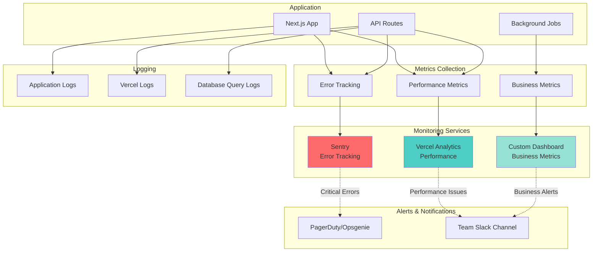

# Monitoring & Observability

This diagram shows the comprehensive monitoring and observability strategy for the SSL Certificate Tracking System.



## Key Metrics to Monitor

### 1. Application Performance Metrics

```typescript
// lib/monitoring/metrics.ts
export interface PerformanceMetrics {
  // API Response Times
  apiResponseTime: {
    p50: number;  // 50th percentile
    p95: number;  // 95th percentile
    p99: number;  // 99th percentile
    max: number;
  };
  
  // Certificate Check Performance
  certificateCheckDuration: {
    average: number;
    max: number;
    failures: number;
  };
  
  // Database Performance
  databaseQueryTime: {
    p50: number;
    p95: number;
    p99: number;
  };
  
  // Memory and CPU
  memoryUsage: number;    // MB
  cpuUsage: number;       // percentage
}

// Track API response times
export async function trackApiMetrics(
  endpoint: string,
  duration: number,
  statusCode: number
) {
  await metrics.histogram('api.response.time', duration, {
    endpoint,
    status: statusCode.toString(),
  });
}
```

### 2. Business Metrics

```typescript
// lib/monitoring/business-metrics.ts
export interface BusinessMetrics {
  // Certificate Statistics
  totalCertificates: number;
  activeCertificates: number;
  expiringCertificates: number;
  expiredCertificates: number;
  errorCertificates: number;
  
  // Check Statistics
  checksPerformed24h: number;
  checkSuccessRate: number;      // percentage
  averageCheckDuration: number;   // milliseconds
  
  // Alert Statistics
  alertsSent24h: number;
  alertsByType: Record<string, number>;
  alertsAcknowledged: number;
  
  // User Activity
  activeUsers: number;
  certificatesAddedToday: number;
  manualChecksTriggered: number;
}

export async function collectBusinessMetrics(): Promise<BusinessMetrics> {
  const [
    totalCerts,
    activeCerts,
    expiringCerts,
    expiredCerts,
    errorCerts
  ] = await Promise.all([
    db.select({ count: sql<number>`count(*)` })
      .from(certificates),
    db.select({ count: sql<number>`count(*)` })
      .from(certificates)
      .where(eq(certificates.status, 'active')),
    db.select({ count: sql<number>`count(*)` })
      .from(certificates)
      .where(eq(certificates.status, 'expiring')),
    db.select({ count: sql<number>`count(*)` })
      .from(certificates)
      .where(eq(certificates.status, 'expired')),
    db.select({ count: sql<number>`count(*)` })
      .from(certificates)
      .where(eq(certificates.status, 'error')),
  ]);
  
  return {
    totalCertificates: totalCerts[0].count,
    activeCertificates: activeCerts[0].count,
    expiringCertificates: expiringCerts[0].count,
    expiredCertificates: expiredCerts[0].count,
    errorCertificates: errorCerts[0].count,
    // ... additional metrics
  };
}
```

### 3. Error Tracking

```typescript
// lib/monitoring/error-tracking.ts
import * as Sentry from '@sentry/nextjs';

export function initializeErrorTracking() {
  Sentry.init({
    dsn: process.env.NEXT_PUBLIC_SENTRY_DSN,
    environment: process.env.NODE_ENV,
    
    // Performance Monitoring
    tracesSampleRate: 1.0,
    
    // Error filtering
    beforeSend(event, hint) {
      // Filter out known non-critical errors
      if (event.exception) {
        const error = hint.originalException;
        if (error?.message?.includes('Network error')) {
          // Don't send network errors to Sentry
          return null;
        }
      }
      return event;
    },
    
    // Add user context
    beforeBreadcrumb(breadcrumb) {
      if (breadcrumb.category === 'console') {
        return null; // Don't send console logs
      }
      return breadcrumb;
    }
  });
}

// Custom error tracking
export function trackError(
  error: Error,
  context?: Record<string, any>
) {
  console.error('Error occurred:', error, context);
  
  Sentry.withScope((scope) => {
    if (context) {
      Object.entries(context).forEach(([key, value]) => {
        scope.setContext(key, value);
      });
    }
    Sentry.captureException(error);
  });
}

// Usage in API routes
export async function GET(request: Request) {
  try {
    // Your code
  } catch (error) {
    trackError(error, {
      endpoint: '/api/certificates',
      method: 'GET',
      timestamp: new Date().toISOString()
    });
    
    return NextResponse.json(
      { error: 'Internal server error' },
      { status: 500 }
    );
  }
}
```

## Logging Strategy

### Structured Logging

```typescript
// lib/logger.ts
import pino from 'pino';

export const logger = pino({
  level: process.env.LOG_LEVEL || 'info',
  
  // Production logging
  ...(process.env.NODE_ENV === 'production' && {
    formatters: {
      level: (label) => ({ level: label }),
    },
  }),
  
  // Development logging (pretty print)
  ...(process.env.NODE_ENV === 'development' && {
    transport: {
      target: 'pino-pretty',
      options: {
        colorize: true,
      },
    },
  }),
});

// Log levels and usage
export const log = {
  debug: (obj: any, msg?: string) => logger.debug(obj, msg),
  info: (obj: any, msg?: string) => logger.info(obj, msg),
  warn: (obj: any, msg?: string) => logger.warn(obj, msg),
  error: (obj: any, msg?: string) => logger.error(obj, msg),
  fatal: (obj: any, msg?: string) => logger.fatal(obj, msg),
};

// Usage examples
log.info(
  { certificateId: cert.id, domain: cert.domain },
  'Certificate check started'
);

log.error(
  { 
    error: error.message,
    stack: error.stack,
    certificateId: cert.id 
  },
  'Certificate check failed'
);

log.warn(
  { 
    certificateId: cert.id,
    daysRemaining: cert.daysUntilExpiry 
  },
  'Certificate expiring soon'
);
```

### Request Logging Middleware

```typescript
// lib/middleware/request-logger.ts
import { NextRequest, NextResponse } from 'next/server';
import { logger } from '@/lib/logger';

export async function requestLogger(
  request: NextRequest,
  handler: () => Promise<Response>
) {
  const startTime = Date.now();
  const requestId = crypto.randomUUID();
  
  // Log request
  logger.info({
    requestId,
    method: request.method,
    url: request.url,
    headers: Object.fromEntries(request.headers),
  }, 'Incoming request');
  
  try {
    const response = await handler();
    const duration = Date.now() - startTime;
    
    // Log response
    logger.info({
      requestId,
      method: request.method,
      url: request.url,
      status: response.status,
      duration,
    }, 'Request completed');
    
    return response;
  } catch (error) {
    const duration = Date.now() - startTime;
    
    // Log error
    logger.error({
      requestId,
      method: request.method,
      url: request.url,
      error: error.message,
      stack: error.stack,
      duration,
    }, 'Request failed');
    
    throw error;
  }
}
```

## Alerting Rules

### Critical Alerts (Immediate Response)

```typescript
// lib/monitoring/alert-rules.ts
interface AlertRule {
  name: string;
  condition: () => Promise<boolean>;
  severity: 'critical' | 'high' | 'medium' | 'low';
  channels: ('pagerduty' | 'slack' | 'email')[];
  message: string;
}

export const criticalAlerts: AlertRule[] = [
  {
    name: 'High Error Rate',
    condition: async () => {
      const errorRate = await getErrorRate('5m');
      return errorRate > 5; // 5% error rate
    },
    severity: 'critical',
    channels: ['pagerduty', 'slack'],
    message: 'API error rate exceeds 5% threshold'
  },
  
  {
    name: 'Database Connection Failure',
    condition: async () => {
      try {
        await db.execute('SELECT 1');
        return false;
      } catch {
        return true;
      }
    },
    severity: 'critical',
    channels: ['pagerduty', 'slack'],
    message: 'Unable to connect to database'
  },
  
  {
    name: 'Certificate Check Job Failed',
    condition: async () => {
      const lastRun = await getLastCronJobRun();
      const hoursSinceLastRun = (Date.now() - lastRun.getTime()) / (1000 * 60 * 60);
      return hoursSinceLastRun > 25; // Should run every 24h
    },
    severity: 'high',
    channels: ['slack', 'email'],
    message: 'Certificate check cron job has not run in 25 hours'
  },
  
  {
    name: 'Multiple Certificate Checks Failing',
    condition: async () => {
      const [{ count }] = await db
        .select({ count: sql<number>`count(*)` })
        .from(certificates)
        .where(eq(certificates.status, 'error'));
      
      return count > 10;
    },
    severity: 'high',
    channels: ['slack'],
    message: 'More than 10 certificates are in error state'
  }
];

// Alert evaluation loop
export async function evaluateAlertRules() {
  for (const rule of criticalAlerts) {
    try {
      const triggered = await rule.condition();
      
      if (triggered) {
        await sendAlert({
          name: rule.name,
          severity: rule.severity,
          message: rule.message,
          channels: rule.channels,
          timestamp: new Date()
        });
      }
    } catch (error) {
      logger.error(
        { rule: rule.name, error: error.message },
        'Failed to evaluate alert rule'
      );
    }
  }
}
```

## Dashboards

### Application Health Dashboard

```typescript
// app/api/admin/metrics/route.ts
export async function GET() {
  const metrics = await collectBusinessMetrics();
  const performance = await collectPerformanceMetrics();
  const health = await checkSystemHealth();
  
  return NextResponse.json({
    timestamp: new Date().toISOString(),
    business: metrics,
    performance,
    health,
    status: health.healthy ? 'healthy' : 'unhealthy'
  });
}

async function checkSystemHealth() {
  const checks = {
    database: false,
    email: false,
    cron: false
  };
  
  // Database check
  try {
    await db.execute('SELECT 1');
    checks.database = true;
  } catch (error) {
    logger.error({ error }, 'Database health check failed');
  }
  
  // Email service check (if configured)
  if (process.env.RESEND_API_KEY) {
    // Could implement a test send or API ping
    checks.email = true;
  }
  
  // Cron job check
  const lastRun = await getLastCronJobRun();
  const hoursSince = (Date.now() - lastRun.getTime()) / (1000 * 60 * 60);
  checks.cron = hoursSince < 25;
  
  return {
    healthy: Object.values(checks).every(v => v),
    checks,
    timestamp: new Date().toISOString()
  };
}
```

### Monitoring Dashboard Component

```typescript
// components/admin/monitoring-dashboard.tsx
'use client';

import { useEffect, useState } from 'react';
import { Card, CardContent, CardHeader, CardTitle } from '@/components/ui/card';

interface SystemMetrics {
  business: BusinessMetrics;
  performance: PerformanceMetrics;
  health: HealthStatus;
}

export function MonitoringDashboard() {
  const [metrics, setMetrics] = useState<SystemMetrics | null>(null);
  
  useEffect(() => {
    const fetchMetrics = async () => {
      const res = await fetch('/api/admin/metrics');
      const data = await res.json();
      setMetrics(data);
    };
    
    fetchMetrics();
    const interval = setInterval(fetchMetrics, 30000); // Update every 30s
    
    return () => clearInterval(interval);
  }, []);
  
  if (!metrics) return <div>Loading...</div>;
  
  return (
    <div className="space-y-6">
      <h1 className="text-3xl font-bold">System Monitoring</h1>
      
      <div className="grid grid-cols-1 md:grid-cols-3 gap-4">
        <Card>
          <CardHeader>
            <CardTitle>Total Certificates</CardTitle>
          </CardHeader>
          <CardContent>
            <p className="text-4xl font-bold">{metrics.business.totalCertificates}</p>
          </CardContent>
        </Card>
        
        <Card>
          <CardHeader>
            <CardTitle>Expiring Soon</CardTitle>
          </CardHeader>
          <CardContent>
            <p className="text-4xl font-bold text-yellow-600">
              {metrics.business.expiringCertificates}
            </p>
          </CardContent>
        </Card>
        
        <Card>
          <CardHeader>
            <CardTitle>Expired</CardTitle>
          </CardHeader>
          <CardContent>
            <p className="text-4xl font-bold text-red-600">
              {metrics.business.expiredCertificates}
            </p>
          </CardContent>
        </Card>
      </div>
      
      <Card>
        <CardHeader>
          <CardTitle>System Health</CardTitle>
        </CardHeader>
        <CardContent>
          <div className="space-y-2">
            <HealthIndicator
              name="Database"
              healthy={metrics.health.checks.database}
            />
            <HealthIndicator
              name="Email Service"
              healthy={metrics.health.checks.email}
            />
            <HealthIndicator
              name="Cron Jobs"
              healthy={metrics.health.checks.cron}
            />
          </div>
        </CardContent>
      </Card>
    </div>
  );
}

function HealthIndicator({ name, healthy }: { name: string; healthy: boolean }) {
  return (
    <div className="flex items-center justify-between">
      <span>{name}</span>
      <span className={healthy ? 'text-green-600' : 'text-red-600'}>
        {healthy ? '✓ Healthy' : '✗ Unhealthy'}
      </span>
    </div>
  );
}
```

## Uptime Monitoring

### External Monitoring Setup

```yaml
# Example: UptimeRobot Configuration
monitors:
  - name: "SSL Tracker - Homepage"
    url: "https://yourdomain.com"
    interval: 5  # minutes
    alert_contacts:
      - type: email
        value: ops@company.com
      - type: slack
        value: webhook_url
  
  - name: "SSL Tracker - API Health"
    url: "https://yourdomain.com/api/health"
    interval: 5
    keyword: "ok"  # Check for "ok" in response
    alert_contacts:
      - type: email
        value: ops@company.com
  
  - name: "SSL Tracker - Cron Job"
    url: "https://yourdomain.com/api/cron/check-certificates"
    interval: 60  # Check hourly
    alert_contacts:
      - type: pagerduty
        value: integration_key
```

## Performance Monitoring

### Vercel Analytics Integration

```typescript
// app/layout.tsx
import { Analytics } from '@vercel/analytics/react';
import { SpeedInsights } from '@vercel/speed-insights/next';

export default function RootLayout({ children }) {
  return (
    <html lang="en">
      <body>
        {children}
        <Analytics />
        <SpeedInsights />
      </body>
    </html>
  );
}
```

### Custom Performance Tracking

```typescript
// lib/monitoring/performance.ts
export async function trackPerformance(
  operation: string,
  fn: () => Promise<any>
) {
  const startTime = performance.now();
  
  try {
    const result = await fn();
    const duration = performance.now() - startTime;
    
    // Log performance
    logger.info({
      operation,
      duration,
      success: true
    }, 'Operation completed');
    
    // Send to monitoring service
    await recordMetric('operation.duration', duration, {
      operation,
      status: 'success'
    });
    
    return result;
  } catch (error) {
    const duration = performance.now() - startTime;
    
    logger.error({
      operation,
      duration,
      error: error.message
    }, 'Operation failed');
    
    await recordMetric('operation.duration', duration, {
      operation,
      status: 'error'
    });
    
    throw error;
  }
}

// Usage
const certificates = await trackPerformance(
  'fetch_certificates',
  () => db.select().from(certificates)
);
```
